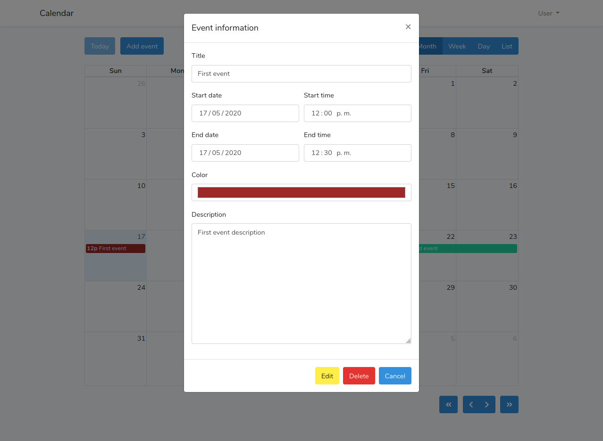

## Laravel Fullcalendar

Aplicacion demo con CRUD basico de eventos por medio de jQuery (ajax) y Laravel.

## Instalar y configurar el proyecto

- __Requisitos:__  
    PHP >= 7.2.5  
    [Composer](https://getcomposer.org)  
    [NodeJS](https://nodejs.org)

- Clonar repositorio e ingresar al directorio principal  
`git clone https://github.com/alejandro-ser/laravel-fullcalendar.git`  
`cd laravel-fullcalendar`
- Crear una base de datos en MySQL
- Copiar ó renombrar el archivo __*.env.example*__ a __*.env*__  
`cp .env.example .env`  
- Agregar la conexión a la base de de datos en **_.env_**:  
_DB_CONNECTION=mysql_  
_DB_HOST=127.0.0.1_  
_DB_PORT=3306_  
_DB_DATABASE=_**_Tu_base_de_datos_va_aquí_**  
_DB_USERNAME=_**_Tus_credenciales_van_aquí_**  
_DB_PASSWORD=_**_Tus_credenciales_van_aquí_**
- Ejecutar los comandos:  
`composer install` (instalar dependencias de Laravel)  
`php artisan migrate` (crear tablas en la base de datos)  
`npm install && npm run dev` (compilar los scripts JS y estilos CSS)  
`php artisan serve` (iniciar proyecto en servidor local)
- Ingresar a la url **_http://127.0.0.1:8000_**

### Ingresar
- Crear una cuenta e iniciar sesión para poder ver el calendario

## Librerias usadas

- **[FullCalendar.io](https://fullcalendar.io/)**

## Imagenes demo

## License
[Licencia MIT](https://github.com/alejandro-ser/laravel-fullcalendar/blob/master/LICENSE)
